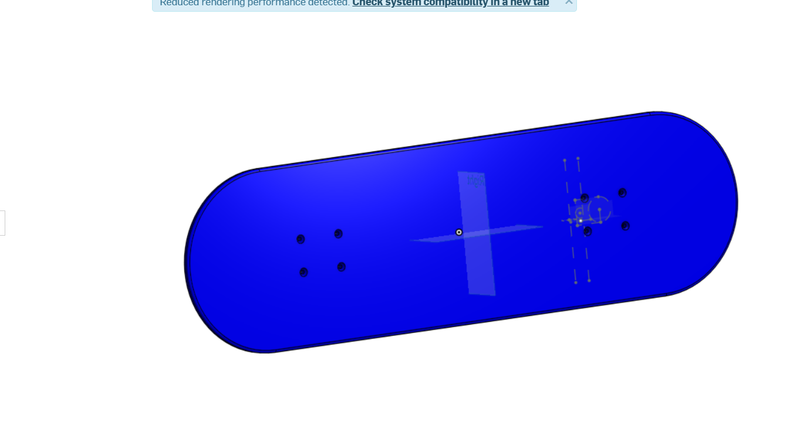

# Intermediate-CAD

# Image

# Reflection
The Deck was pretty easy to build all it consisted of was the sketch of the actual deck, an extrusion of that sketch, holes for the screws, and the filet to smooth out
the edges

# Evidence
https://cvilleschools.onshape.com/documents/3a7bda1412c8a84cea9338a8/w/545f68b0c85315e8c036efaf/e/75141e9f4cfdb3e77f773b76

#Image
