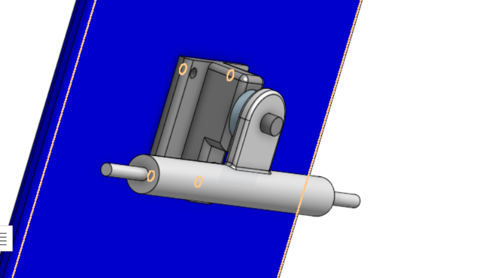
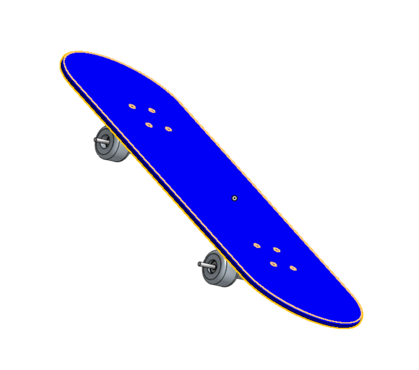

# Intermediate-CAD

# Image

# Reflection
The Deck was pretty easy to build all it consisted of was the sketch of the actual deck, an extrusion of that sketch, holes for the screws, and the filet to smooth out
the edges

# Evidence
https://cvilleschools.onshape.com/documents/3a7bda1412c8a84cea9338a8/w/545f68b0c85315e8c036efaf/e/75141e9f4cfdb3e77f773b76

# Image

# Reflection
The trucks weren't all too hard to build, they took me about 2 classes and I got stuck for a little bit but apart from that it wasn't too hard.

# Evidence
https://cvilleschools.onshape.com/documents/3a7bda1412c8a84cea9338a8/w/545f68b0c85315e8c036efaf/e/75141e9f4cfdb3e77f773b76

# Image

# Reflection
The wheel was much easier than the trucks, all it composed of was one sketch, a revolution, and a fillet.

# Evidence
https://cvilleschools.onshape.com/documents/3a7bda1412c8a84cea9338a8/w/545f68b0c85315e8c036efaf/e/40c6aa85cd43b3fe5a2cf03b

# Image

# Reflection
The skateboard was basically everything I learned last year on onshape, It used all of the features that I'd most likely use in the future.

# Evidence
https://cvilleschools.onshape.com/documents/3a7bda1412c8a84cea9338a8/w/545f68b0c85315e8c036efaf/e/617ee0be7b9ca6d7f1a37e35

# Image

# Reflection
The lego was very easy to build, it took me about 20 mins

# Evidence
https://cvilleschools.onshape.com/documents/963d2209c43a357a4de867f3/w/88ab3796c5d53341b7b41ab7/e/20632b68692226286fd9c143

#  Image

# Reflection
The Configuration Table was very useful to have multiple types of bricks. It took a decent amount of time to set it up though.

# Evidence
https://cvilleschools.onshape.com/documents/963d2209c43a357a4de867f3/w/88ab3796c5d53341b7b41ab7/e/20632b68692226286fd9c143
